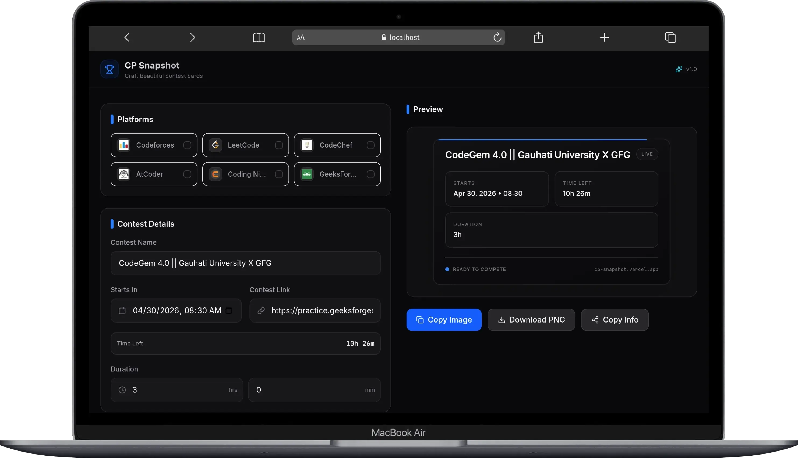

# 🏆 CP Snapshot

> Generate beautiful, shareable contest snapshots for competitive programming platforms — 100% client-side.



## ✨ Features

- 🎨 **9 Professional Themes**: Midnight, Dawn, Aurora, Forest, Sunset, Nord, Cyber, Dracula, Mono
- 📱 **Fully Responsive**: Mobile-first design that works on any device
- 🖼️ **Export Options**: Copy PNG to clipboard, download locally, or copy formatted text
- ⚡ **Live Countdown**: Auto-calculating "Time Left" that updates every second
- 🔗 **Contest Link Support**: Include registration links in copied text (hidden from card)
- 🎯 **Platform Badges**: Codeforces, LeetCode, CodeChef, AtCoder, Coding Ninjas, GeeksForGeeks
- 🔒 **Privacy First**: No backend, no tracking, no data leaves your browser

## 🚀 Quick Start

### Prerequisites

- [Bun](https://bun.sh) (recommended) or Node.js 18+

### Installation

```bash
# Clone the repo
git clone https://github.com/maruf-pfc/cp-snapshot.git
cd cp-snapshot

# Install dependencies
bun install

# Start dev server
bun run dev
```

Open [http://localhost:5173](http://localhost:5173) in your browser.

### Build for Production

```bash
bun run build
# Output: dist/ folder ready for deployment
```

### Preview Production Build

```bash
bun run preview
```

## 🎨 Usage Guide

### 1. Select Platforms

Click platforms to include in your snapshot. Selected platforms appear as badges on the card.

### 2. Enter Contest Details

- **Contest Name**: e.g., "Codeforces Round 923 (Div. 2)"
- **Starts In**: Date/time when contest begins
- **Contest Link**: Optional registration/contest URL (included in copied text only)
- **Duration**: Hours + minutes of contest length

> 💡 **Time Left** auto-calculates from "Starts In" and updates live.

### 3. Choose a Theme

Switch between 9 curated themes. Preview updates instantly.

### 4. Export Your Snapshot

| Button          | Action                                                    |
| --------------- | --------------------------------------------------------- |
| 📋 Copy Image   | Copies PNG to clipboard (paste in Discord, Twitter, etc.) |
| ⬇️ Download PNG | Saves high-res PNG to your device                         |
| 📤 Copy Info    | Copies formatted text with all contest details + link     |

## 🛠️ Tech Stack

| Category     | Technology                                |
| ------------ | ----------------------------------------- |
| Framework    | React 19 + Vite                           |
| Language     | TypeScript                                |
| Styling      | TailwindCSS v4 (with `@tailwindcss/vite`) |
| State        | Zustand 5                                 |
| Icons        | Lucide React                              |
| Image Export | html-to-image                             |
| Date Utils   | date-fns                                  |
| Utilities    | clsx                                      |

## 📁 Project Structure

```
cp-snapshot/
├── public/
│   └── logos/              # Platform logo images
├── src/
│   ├── components/         # React components
│   │   ├── PlatformSelector.tsx
│   │   ├── ContestForm.tsx
│   │   ├── SnapshotCard.tsx
│   │   ├── ThemeSelector.tsx
│   │   └── ActionButtons.tsx
│   ├── features/           # Feature modules (future expansion)
│   ├── hooks/              # Custom React hooks
│   │   ├── useContestStore.ts
│   │   └── useLiveTimeLeft.ts
│   ├── utils/              # Pure utility functions
│   │   ├── platforms.ts
│   │   ├── themes.ts
│   │   └── formatters.ts
│   ├── types/              # TypeScript type definitions
│   │   └── index.ts
│   ├── styles/             # Global styles
│   │   └── globals.css
│   ├── App.tsx             # Main app component
│   └── main.tsx            # Entry point
├── index.html              # Vite entry HTML
├── vite.config.ts          # Vite + Tailwind v4 config
├── tsconfig*.json          # TypeScript configuration
├── package.json            # Dependencies & scripts
└── README.md               # This file
```

## 🎨 Theme Gallery

| Theme        | Preview                     | Best For              |
| ------------ | --------------------------- | --------------------- |
| **Midnight** | 🌙 Dark with violet accent  | Default, professional |
| **Dawn**     | 🌅 Light with indigo accent | Presentations, docs   |
| **Aurora**   | 🌌 Deep blue with cyan      | Night owls, streamers |
| **Forest**   | 🌲 Dark green with emerald  | Nature lovers         |
| **Sunset**   | 🌇 Purple with amber        | Creative contests     |
| **Nord**     | ❄️ Arctic blue palette      | Minimalist coders     |
| **Cyber**    | ⚡ Neon cyan on black       | Cyberpunk vibes       |
| **Dracula**  | 🧛 Pink accent on dark      | Theme enthusiasts     |
| **Mono**     | ⚫⚪ Strict grayscale       | Print, accessibility  |

## 🔧 Development

### Adding a New Platform

1. Add logo to `public/logos/` (PNG/JPG, ~64x64px)
2. Update `src/utils/platforms.ts`:
   ```typescript
   { id: 'newplatform', name: 'New Platform', color: '#HEX', logo: '/logos/newplatform.png' }
   ```
3. (Optional) Add platform-specific CSS variable in `globals.css`

### Adding a New Theme

1. Add entry to `src/utils/themes.ts`:
   ```typescript
   mytheme: {
     name: 'My Theme',
     bg: '#000000',
     surface: '#111111',
     text: '#ffffff',
     textSec: '#888888',
     accent: '#00ff00',
     border: '#333333'
   }
   ```
2. Theme appears automatically in selector

### Customizing Export Quality

Edit `src/components/ActionButtons.tsx`:

```typescript
toPng(element, {
  quality: 1.0, // 0.1 to 1.0
  pixelRatio: 2, // 1x, 2x (retina), 4x (ultra)
  cacheBust: true,
});
```

## 🌐 Deployment

### Vercel (Recommended)

```bash
# Install Vercel CLI
bun add -g vercel

# Deploy
vercel
```

### Cloudflare Pages

```bash
# Build
bun run build

# Deploy via Wrangler
wrangler pages deploy dist
```

### Netlify

1. Connect repo to Netlify
2. Set build command: `bun run build`
3. Set publish directory: `dist/`
4. Deploy 🚀

### GitHub Pages

```bash
# In package.json, add:
{
  "homepage": "https://yourusername.github.io/cp-snapshot",
  "scripts": {
    "predeploy": "bun run build",
    "deploy": "gh-pages -d dist"
  }
}

# Install & deploy
bun add -D gh-pages
bun run deploy
```

## 🤝 Contributing

Contributions welcome! Here's how:

1. Fork the repo
2. Create a feature branch: `git checkout -b feat/amazing-feature`
3. Commit changes: `git commit -m 'feat: add amazing feature'`
4. Push: `git push origin feat/amazing-feature`
5. Open a Pull Request

### Development Guidelines

- Follow existing code style (Prettier + ESLint)
- Add TypeScript types for new features
- Test on mobile + desktop before submitting
- Keep commits atomic and descriptive

## 🐛 Reporting Issues

Found a bug? Please include:

- Browser + OS version
- Steps to reproduce
- Expected vs actual behavior
- Screenshot if visual issue

[Open an Issue](https://github.com/yourusername/cp-snapshot/issues)

## 📜 License

MIT License — see [LICENSE](LICENSE) for details.

## 🙏 Acknowledgments

- [Linear](https://linear.app) for design inspiration
- [Vercel](https://vercel.com) for deployment excellence
- [Lucide](https://lucide.dev) for beautiful icons
- Competitive programming community for the motivation

---

**Built with ❤️ by competitive programmers, for competitive programmers.**

[⭐ Star on GitHub](https://github.com/maruf-pfc/cp-snapshot) • [🐦 Follow Updates](https://twitter.com/md_marufsarker)
