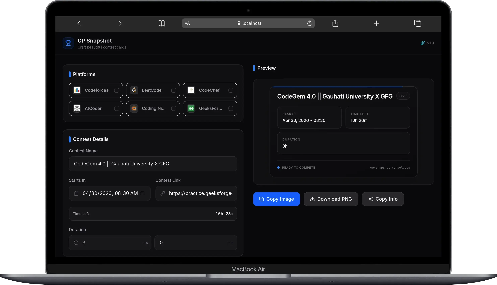

# 🏆 CP Snapshot

> Generate beautiful, shareable contest announcement cards for competitive programming — 100% client-side, no signup required.

[](https://cp-snapshot.vercel.app)
[](https://github.com/maruf-pfc/cp-snapshot/stargazers)
[](LICENSE)
[](https://www.typescriptlang.org/)



---

## ✨ Features

### Standard Contest Mode
- 🎨 **9 Professional Themes**: Midnight, Dawn, Aurora, Forest, Sunset, Nord, Cyber, Dracula, Mono
- 🎯 **Platform Badges**: Codeforces, LeetCode, CodeChef, AtCoder, Coding Ninjas, GeeksForGeeks, Vjudge
- 📱 **Fully Responsive**: Mobile-first design that works on any device
- 🖼️ **Export Options**: Copy PNG to clipboard, download locally, or copy formatted text
- ⚡ **Live Countdown**: Auto-calculating "Time Left" that updates every second
- 🔗 **Contest Link Support**: Include registration links in copied text
- 🔒 **Privacy First**: No backend, no tracking, no data leaves your browser

## 🚀 Quick Start

### Prerequisites

- [Bun](https://bun.sh) (recommended) or Node.js 18+

### Installation

```bash
# Clone the repo
git clone https://github.com/maruf-pfc/cp-snapshot.git
cd cp-snapshot

# Install dependencies
bun install

# Start dev server
bun run dev
```

Open [http://localhost:5173](http://localhost:5173) in your browser.

### Build for Production

```bash
bun run build
# Output: dist/ folder ready for deployment
```

### Preview Production Build

```bash
bun run preview
```

---

## 🗺️ Routes

| Route | Description |
|---|---|
| `/` | Standard contest card generator (Codeforces, LeetCode, etc.) |

---

## 🎨 Usage Guide

### Standard Mode (`/`)

1. **Select Platforms** — Click to add platform badges to the card
2. **Enter Contest Details** — Name, start time, link, duration
3. **Choose a Theme** — 9 curated themes, live preview
4. **Export**

| Button | Action |
|---|---|
| 📋 Copy Image | Copies PNG to clipboard (Discord, Twitter, etc.) |
| ⬇️ Download PNG | Saves high-res PNG to your device |
| 📤 Copy Info | Copies formatted text with all contest details |

### CPS Mode (`/cps/cpc`)

1. Fill in **Contest Name**, **Module No**, **Contest No**, **Contest Link**, **Start Date**
2. End Date auto-fills (Start + 10 days)
3. Preview card updates live
4. Use the action buttons:

| Button | Description |
|---|---|
| Copy Image | Copy snapshot PNG to clipboard |
| Download PNG | Save snapshot to device |
| Copy Announcement | Copy the main Discord `@everyone` announcement |
| Missed Contest Announcement | Opens modal → generates "contest already started" post |
| Days Left Announcement | Opens modal → generates "X days left" reminder post |

## 🛠️ Tech Stack

| Category | Technology |
|---|---|
| Framework | React 19 + Vite 8 |
| Language | TypeScript 6 |
| Styling | TailwindCSS v4 (`@tailwindcss/vite`) |
| State | Zustand 5 |
| Routing | React Router v7 |
| Icons | Lucide React |
| Image Export | html-to-image |
| Date Utils | date-fns 4 |
| Analytics | Vercel Analytics |

---

## 📁 Project Structure

```
cp-snapshot/
├── public/
│   ├── logos/                  # Platform logo images
│   ├── demo.webp               # OG preview image
│   ├── favicon.svg
│   ├── robots.txt
│   └── sitemap.xml
├── src/
│   ├── components/
│   │   ├── ActionButtons.tsx       # Standard mode export buttons
│   │   ├── AnnouncementModals.tsx  # Missed / Days Left modal generators
│   │   ├── ContestForm.tsx         # Standard contest input form
│   │   ├── PlatformSelector.tsx    # Platform badge picker
│   │   ├── SnapshotCard.tsx        # Card preview (all modes)
│   │   └── ThemeSelector.tsx       # Theme switcher
│   ├── hooks/
│   │   ├── useContestStore.ts      # Global Zustand state
│   │   └── useLiveTimeLeft.ts      # Live countdown hook
│   ├── pages/
│   │   ├── CPS.tsx                 # /cps/cpc page
│   │   └── CPSWeekly.tsx           # /cps/weekly page
│   ├── utils/
│   │   ├── cpsFormatter.ts         # CPC announcement formatter
│   │   ├── formatters.ts           # General formatters
│   │   ├── platforms.ts            # Platform definitions
│   │   ├── themes.ts               # Theme definitions
│   │   └── weeklyFormatter.ts      # Weekly announcement formatter
│   ├── types/
│   │   └── index.ts                # TypeScript type definitions
│   ├── styles/
│   │   └── globals.css             # Global + Tailwind base styles
│   ├── App.tsx                     # Standard home page
│   └── main.tsx                    # Entry point + routing
├── index.html                      # Vite HTML entry (SEO meta tags)
├── vercel.json                     # Vercel deployment config
├── vite.config.ts
├── tsconfig*.json
├── package.json
└── README.md
```

---

## 🎨 Theme Gallery

| Theme | Preview | Best For |
|---|---|---|
| **Midnight** | 🌙 Dark with violet accent | Default, professional |
| **Dawn** | 🌅 Light with indigo accent | Presentations, docs |
| **Aurora** | 🌌 Deep blue with cyan | Night owls, streamers |
| **Forest** | 🌲 Dark green with emerald | Nature lovers |
| **Sunset** | 🌇 Purple with amber | Creative contests |
| **Nord** | ❄️ Arctic blue palette | Minimalist coders |
| **Cyber** | ⚡ Neon cyan on black | Cyberpunk vibes |
| **Dracula** | 🧛 Pink accent on dark | Theme enthusiasts |
| **Mono** | ⚫⚪ Strict grayscale | Print, accessibility |

---

## 🔧 Development

### Adding a New Platform

1. Add logo to `public/logos/` (PNG/SVG, ~64×64px)
2. Update `src/utils/platforms.ts`:
   ```typescript
   { id: 'newplatform', name: 'New Platform', color: '#HEX', logo: '/logos/newplatform.png' }
   ```

### Adding a New Theme

Update `src/utils/themes.ts`:
```typescript
mytheme: {
  name: 'My Theme',
  bg: '#000000',
  surface: '#111111',
  text: '#ffffff',
  textSec: '#888888',
  accent: '#00ff00',
  border: '#333333'
}
```
Theme appears automatically in the selector.

### Customizing Export Quality

Edit `src/components/ActionButtons.tsx`:
```typescript
toPng(element, {
  quality: 1.0,   // 0.1 → 1.0
  pixelRatio: 2,  // 1x, 2x (retina), 4x (ultra)
  cacheBust: true,
});
```

---

## 🌐 Deployment

### Vercel (Recommended)

Connect the GitHub repo to Vercel — it auto-detects Vite and deploys on every push. No extra config needed; `vercel.json` is already set up.

### Netlify

1. Connect repo to Netlify
2. Build command: `bun run build`
3. Publish directory: `dist/`
4. Deploy 🚀

### Cloudflare Pages

```bash
bun run build
wrangler pages deploy dist
```

---

## 🤝 Contributing

Contributions are welcome!

1. Fork the repo
2. Create a feature branch: `git checkout -b feat/amazing-feature`
3. Commit: `git commit -m 'feat: add amazing feature'`
4. Push: `git push origin feat/amazing-feature`
5. Open a Pull Request

**Guidelines:** Follow existing code style · Add TypeScript types · Test on mobile + desktop · Keep commits atomic.

---

## 🐛 Reporting Issues

Found a bug? Open an [issue](https://github.com/maruf-pfc/cp-snapshot/issues) and include:
- Browser + OS version
- Steps to reproduce
- Expected vs actual behaviour
- Screenshot if visual

---

## 📜 License

MIT License — see [LICENSE](LICENSE) for details.

---

## 🙏 Acknowledgments

- [Linear](https://linear.app) for design inspiration
- [Vercel](https://vercel.com) for hosting & analytics
- [Lucide](https://lucide.dev) for beautiful icons
- CPS Academy & the competitive programming community

---

**Built with ❤️ by [Maruf Sarker](https://www.linkedin.com/in/mdmarufsarker) for competitive programmers.**

[⭐ Star on GitHub](https://github.com/maruf-pfc/cp-snapshot) · [🌐 Live Demo](https://cp-snapshot.vercel.app)
